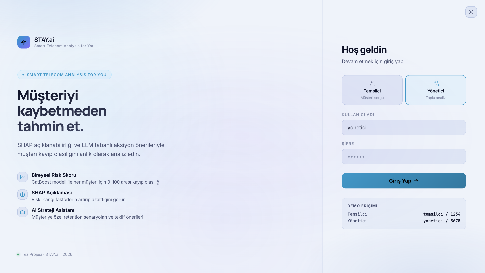
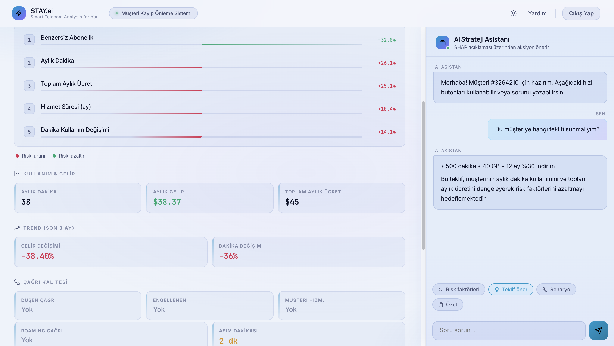
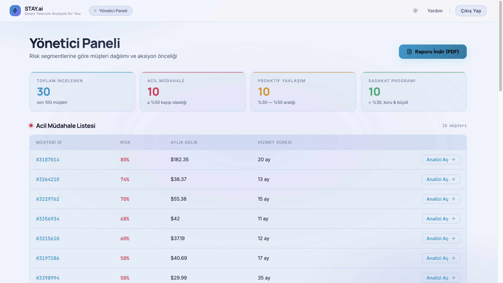

<div align="center">

# STAY.ai

### Akıllı Telekom Müşteri Analizi
*Smart Telecom Analysis for You*

**Açıklanabilir Yapay Zeka ve LLM Tabanlı Müşteri Kayıp Önleme Sistemi**

[](https://www.python.org/)
[](https://fastapi.tiangolo.com/)
[](https://catboost.ai/)
[](https://shap.readthedocs.io/)
[](LICENSE)

</div>

---

## 📌 Proje Hakkında

**STAY.ai**, telekomünikasyon sektöründe müşteri kaybını (churn) önlemeye yönelik geliştirilmiş, **uçtan uca bir karar destek sistemidir**. Sistem; her müşteri için kayıp olasılığını tahmin eder, bu tahmini bireysel olarak açıklar ve büyük dil modeli (LLM) ile somut aksiyon önerileri üretir.

Telekom sektöründe terk eden bir müşteriyi yeniden kazanmanın maliyeti, mevcut müşteriyi tutmanın **5-10 katıdır**. Bu sistem, çağrı merkezi temsilcisinin karar verme sürecini **5 dakikadan 30 saniyeye** indirir.

###  Proje Amacı

> Çağrı merkezi temsilcilerinin *"hangi müşteriyi neden aramalıyım?"* sorusuna saniyeler içinde, açıklanabilir ve aksiyon odaklı cevaplar vermek.

### Akademik Bağlam

Bu proje, **Pamukkale Üniversitesi Yönetim Bilişim Sistemleri Bölümü** lisans bitirme tezi kapsamında geliştirilmiştir.

- **Yazar:** Senanur SIR
- **Danışman:** Özlü DOLMA
- **Yıl:** Mayıs 2026

---

##  Temel Özellikler

| Özellik | Açıklama |
|---------|----------|
|  **Bireysel Risk Tahmini** | CatBoost ile her müşteri için 0-100 arası kayıp olasılığı |
|  **SHAP Açıklanabilirliği** | Riski hangi faktörlerin artırıp azalttığı bireysel düzeyde görselleştirme |
|  **AI Strateji Asistanı** | Gemini 2.5 Flash-Lite ile risk seviyesine özel aksiyon önerileri |
|  **İki Rollü Arayüz** | Temsilci paneli (sorgu) + Yönetici paneli (segment yönetimi) |
|  **Otomatik Segmentasyon** | Acil / Proaktif / Sadakat segmentlerine otomatik dağılım |
|  **PDF Rapor** | ReportLab ile yönetici özet raporu üretimi |
|  **Modern UI** | Dark/light tema, animasyonlu göstergeler, sezgisel chat |

---

##  Ekran Görüntüleri

### Giriş Ekranı
İki rollü kimlik doğrulama sistemi. Temsilci ve yönetici rolleri ayrı arayüzlere yönlendirir.



---

### Temsilci Paneli — Müşteri Detay
Müşteri ID girilerek anlık risk skoru, SHAP destekli açıklama ve AI strateji asistanı sunulur. Temsilci, 30 saniyede aksiyona geçebileceği kısa brifingler alır.



**Ekranda görünen bileşenler:**
- Animasyonlu risk göstergesi (0-100% kayıp olasılığı)
- SHAP barları — riski artıran (kırmızı) ve azaltan (yeşil) ilk 5 faktör
- Müşteri demografik ve kullanım kartları
- AI Strateji Asistanı chat paneli (Gemini LLM)

---

### Yönetici Paneli — Segment Yönetimi
100 müşterilik portföy üç risk segmentine ayrılmış halde görüntülenir. Segment dağılımı, aksiyon önceliği ve kapsamlı PDF raporu erişilir.



**Ekranda görünen bileşenler:**
- 4 KPI kartı: Toplam / Acil / Proaktif / Sadakat
- Üç ayrı segment tablosu, risk yüzdesine göre sıralanmış
- "Analizi Aç" butonu ile müşteri detayına geçiş
- PDF rapor indirme

---

##  Sistem Mimarisi

```
┌──────────────────────────────────────────────────────────┐
│                    KULLANICI ARAYÜZÜ                     │
│        Temsilci Paneli  ·  Yönetici Paneli               │
└──────────────────────┬───────────────────────────────────┘
                       │ HTTP / JSON
┌──────────────────────▼───────────────────────────────────┐
│                  FASTAPI BACKEND                         │
│  /api/login  /api/customer/{id}  /api/chat               │
│  /api/customers/top-risky        /api/report/pdf         │
└──┬────────────────┬──────────────────┬──────────────────┘
   │                │                  │
   ▼                ▼                  ▼
┌─────────┐  ┌─────────────┐  ┌──────────────────┐
│CatBoost │  │    SHAP     │  │   Gemini LLM     │
│ Model   │  │TreeExplainer│  │ (Aksiyon önerisi)│
└─────────┘  └─────────────┘  └──────────────────┘
```

### Veri Akışı

```
Müşteri ID girilir
   ↓
predict_customer_churn(id) → probability
   ↓
SHAP TreeExplainer → bireysel feature contributions
   ↓
Risk tier hesaplanır (Acil / Proaktif / Sadakat)
   ↓
JSON döner: {churn_proba, shap_top_factors, customer_data}
   ↓
Frontend: gauge + SHAP barları + müşteri kartları
   ↓
Kullanıcı chat'te soru sorar
   ↓
build_customer_context() + tier-based prompt + Gemini API
   ↓
LLM 3-4 cümlelik aksiyon brifingi döner
```

---

##  Teknik Detaylar

###  Veri Seti

| Özellik | Değer |
|---------|-------|
| Kaynak | Cell2Cell (Duke University, açık veri) |
| Satır sayısı | ~71.000 müşteri |
| Özellik sayısı | 58 sütun |
| Eğitim/Test | 51.047 / 20.000 (stratified) |
| Hedef değişken | `Churn` (binary) |
| Sınıf dengesi | %29 churn, %71 sadık (1:2.5 oranı) |

###  Modelleme: CatBoost

**Neden CatBoost?**
- Kategorik sütunlar (17 adet) için **native handling** — Ordered Target Encoding
- **Ordered Boosting** ile target leakage'a karşı dayanıklı
- Daha az hiperparametre tuning gerektirir

**Hiperparametreler:**
```python
CatBoostClassifier(
    iterations=1000,
    learning_rate=0.05,
    depth=6,
    auto_class_weights='Balanced',
    eval_metric='AUC',
    early_stopping_rounds=50,
    random_state=42
)
```

###  Sınıf Dengesizliği — İki Katmanlı Strateji

**Katman 1: SMOTENC**
- Karışık tip (sayısal + kategorik) veri için SMOTE varyantı
- Azınlık sınıfı (`churn=1`) **%70 oversample** edildi
- Yeni sentetik örnekler oluşturuldu

**Katman 2: CatBoost Class Weighting**
- `auto_class_weights='Balanced'` parametresi
- Formül: `weight_class = n_total / (2 * n_class)`
- Kalan dengesizliği telafi eder

###  Akıllı Eşik Optimizasyonu

Standart 0.50 eşiği dengesiz veride yanıltıcıdır. Bu sistem:

- **Youden's J Statistic**: `J = Sensitivity + Specificity − 1`
- **Balanced Accuracy**: `(Sensitivity + Specificity) / 2`
- Her iki metrik için optimum eşik bulunur, ortalaması alınır
- **Sonuç:** Eşik = **0.27**

Recall öncelikli kalibrasyon — "şüpheli müşteriyi gözden kaçırma" felsefesi.

###  Model Performansı (20K Holdout Test Seti)

| Metrik | Değer |
|--------|-------|
| **ROC-AUC** | 0.67 |
| **Recall (Churn)** | 0.83 |
| **Precision (Churn)** | 0.34 |
| **F1 Score** | 0.48 |
| **Accuracy** | ~0.62 |

> Class 0 recall'undaki tradeoff, agresif retention stratejisi için bilinçli bir tercihtir. Telekom retention ekonomisinde yanlış alarm maliyeti, kaçırılan churner maliyetinden çok düşüktür.

###  SHAP Açıklanabilirliği

- **Kütüphane:** `shap` (Lundberg & Lee, 2017)
- **Yöntem:** `TreeExplainer` — CatBoost gibi ağaç tabanlı modellere özel
- **Çıktı:** Her müşteri için her özelliğin kayıp olasılığına katkı miktarı
- **Görselleştirme:** İlk 5 faktör, kırmızı (risk artırıcı) / yeşil (koruyucu) barlar ile
- **Yaklaşım:** Local explanation (her müşteri için ayrı, global değil)

###  Risk Tier Segmentasyonu

Operasyonel önceliklendirme için 3 segment:

| Tier | Risk Aralığı | Önerilen Aksiyon |
|------|--------------|------------------|
| 🔴 **Acil Müdahale** | ≥ %50 | Telefon araması, kişisel teklif |
| 🟡 **Proaktif Yaklaşım** | %30 — %50 | SMS / e-posta, hizmet kalitesi izleme |
| 🟢 **Sadakat Programı** | < %30 | Aktif iletişim yok, otomatik teşekkür |

###  LLM Aksiyon Katmanı

**Model:** Google Gemini 2.5 Flash-Lite

**Parametreler:**
```python
{
    "temperature": 0.4,
    "max_output_tokens": 400,
    "top_p": 0.9,
    "thinking_budget": 0
}
```

**Prompt Mimarisi (Tier-Based):**
1. **System Instruction** — Genel kural (3-4 cümle, resmi, Evet/Hayır)
2. **Customer Context** — SHAP faktörleri + müşteri profili
3. **Tier Directive** — Risk seviyesine özel ton/strateji
4. **Template** — Sorunun tipine özel (risk_factors, suggest_offer, call_script, summary)
5. **Conversation History** — Son 4 mesaj

**Örnek Çıktı:**
> *"Evet, bu müşterinin aranması önemle önerilmektedir. Kayıp olasılığı %78.8 ile acil müdahale segmentinde yer almaktadır. Son üç aydaki dakika kullanımındaki %61.1'lik artış, mevcut paketin yetersiz kaldığına işaret etmektedir. Bir üst pakete altı aylık %20 indirimli geçiş teklifi sunulması uygundur."*

---

##  Teknoloji Yığını

### Backend
- **Python 3.12**
- **FastAPI** — Async web framework
- **Jinja2** — Template engine
- **Uvicorn** — ASGI server
- **CatBoost 1.2.7** — Gradient boosting model
- **SHAP 0.46.0** — Açıklanabilir AI
- **scikit-learn 1.5.2** — Veri işleme
- **imbalanced-learn 0.12.4** — SMOTENC
- **google-genai** — Gemini API SDK
- **ReportLab** — PDF üretimi

### Frontend
- **Vanilla HTML / CSS / JavaScript** *(framework-less, bilinçli tercih)*
- **Manrope** + **Inter** + **JetBrains Mono** (typography)
- **Lucide SVG icons**
- **CSS Variables** ile dark/light mode

### Data
- **Cell2Cell Customer Churn Dataset** (~71K müşteri, 58 özellik)

---

##  Proje Yapısı

```
CUSTOMER_CHURN_ANALYSIS/
├── main.py                    # FastAPI ana uygulama
├── model.py                   # CatBoost model + SHAP wrapper
├── llm_service.py             # Gemini LLM entegrasyonu
├── report_service.py          # PDF rapor üretimi
├── catboost_model.cbm         # Eğitilmiş model artifact
├── threshold.json             # Optimum eşik (0.27)
├── requirements.txt           # Python bağımlılıkları
├── .env.example               # Ortam değişkenleri şablonu
│
├── data/
│   └── cell2cell.csv          # Veri seti
│
├── templates/
│   ├── login.html             # Giriş ekranı
│   ├── index.html             # Temsilci paneli
│   └── manager.html           # Yönetici paneli
│
├── static/
│   └── yardim.js              # Yardım modali
│
├── notebooks/
│   ├── 01_eda.ipynb           # Keşifsel veri analizi
│   ├── 02_modeling.ipynb      # CatBoost eğitimi
│   └── 03_shap_analysis.ipynb # SHAP analizi
│
└── screenshots/               # README ekran görüntüleri
    ├── login.png
    ├── agent.png
    └── manager.png
```

---

##  Kurulum ve Çalıştırma

### Önkoşullar

- Python 3.12 veya üzeri
- pip
- Google Gemini API anahtarı ([buradan al](https://aistudio.google.com/apikey))

### Adım 1 — Projeyi klonla

```bash
git clone https://github.com/[kullanici-adi]/STAY-ai.git
cd STAY-ai
```

### Adım 2 — Sanal ortam oluştur ve bağımlılıkları kur

```bash
python3 -m venv .venv
source .venv/bin/activate          # macOS/Linux
# .venv\Scripts\activate           # Windows

pip install -r requirements.txt
```

### Adım 3 — Ortam değişkenlerini ayarla

```bash
cp .env.example .env
```

`.env` dosyasını aç ve Gemini API anahtarını ekle:

```env
GEMINI_API_KEY=your_gemini_api_key_here
```

### Adım 4 — Uygulamayı başlat

```bash
python -m uvicorn main:app --host 0.0.0.0 --port 8000 --reload
```

### Adım 5 — Tarayıcıda aç

```
http://127.0.0.1:8000
```

### Demo Kullanıcıları

| Rol | Kullanıcı Adı | Şifre |
|-----|---------------|-------|
| Temsilci | `temsilci` | `1234` |
| Yönetici | `yonetici` | `5678` |

---

##  Referanslar ve Kaynaklar

- **Cell2Cell Dataset**: Duke University, Teradata Center for CRM
- **CatBoost**: Prokhorenkova et al. (2018). *CatBoost: unbiased boosting with categorical features*
- **SHAP**: Lundberg & Lee (2017). *A Unified Approach to Interpreting Model Predictions*
- **Telekom Churn Literatürü**:
  - Verbeke et al. (2012). *Profit-driven churn prediction*
  - Lessmann et al. (2015). *Threshold optimization in imbalanced classification*

---

##  Sınırlılıklar

- **Veri güncelliği**: Cell2Cell veri seti 2003 dönemine aittir. Modern operatör verisi ile genişletilebilir.
- **Kimlik doğrulama**: Prototip seviyesi token tabanlı kimlik doğrulama. Production için JWT + bcrypt + audit log gerekli.
- **LLM bağımlılığı**: Tek sağlayıcı (Gemini). Çoklu sağlayıcı yedekliği veya yerel LLM desteği eklenebilir.
- **Aksiyon önerileri**: LLM çıktıları öneri seviyesindedir; production ortamında onaylı teklif kataloğu + RAG mimarisi gerekli.

---

##  Katkıda Bulunun

Bu proje akademik bir lisans tezi olarak geliştirilmiştir. Geri bildirim ve önerileriniz değerlidir.

---
---

##  İletişim

**[Senanur SIR]**
Pamukkale Üniversitesi Yönetim Bilişim Sistemleri Bölümü

📧 [sirsena10@gmail.com]
🔗 [LinkedIn](https://www.linkedin.com/in/senanursir/)
💻 [GitHub](https://github.com/senanursir)

---

<div align="center">

**STAY.ai** · *Smart Telecom Analysis for You*

Pamukkale Üniversitesi · Mayıs 2026

</div>
